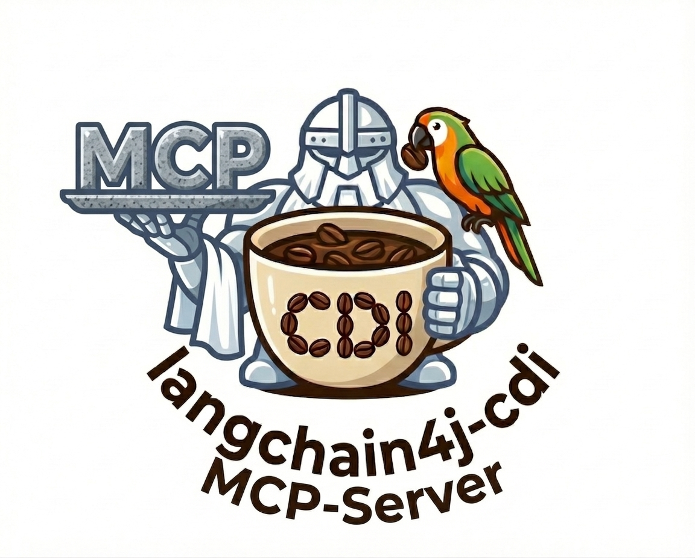

<p align="center">
  
</p>

# LangChain4j CDI — MCP Server

Turn any CDI bean into a [Model Context Protocol (MCP)](https://modelcontextprotocol.io/) server with a few annotations. The server exposes **tools**, **prompts**, and **resources** over HTTP using the Streamable HTTP transport, so any MCP-compatible client (Claude Desktop, VS Code Copilot, custom agents…) can connect to your Jakarta EE / MicroProfile application.

This module builds on the [MCP Java](https://github.com/mcp-java) project, using [java-mcp-annotations](https://github.com/mcp-java/java-mcp-annotations) for the annotation API (`@Tool`, `@Prompt`, `@Resource`, …).

## Table of Contents

- [How It Works](#how-it-works)
- [Getting Started](#getting-started)
  - [1. Add Dependencies](#1-add-dependencies)
  - [2. Write Your First Tool](#2-write-your-first-tool)
  - [3. Run and Connect](#3-run-and-connect)
- [Features](#features)
  - [Tools](#tools)
  - [Prompts](#prompts)
  - [Resources](#resources)
  - [Framework Types (Logging, Progress, Cancellation…)](#framework-types)
- [Runtime Support](#runtime-support)
- [Module Structure](#module-structure)

---

## How It Works

```
┌──────────────┐        JSON-RPC / HTTP         ┌──────────────────────┐
│  MCP Client  │  ───────────────────────────▶   │  Your Jakarta EE App │
│  (Claude,    │                                 │                      │
│   VS Code…)  │  ◀───────────────────────────   │   @Tool, @Prompt,    │
│              │        SSE notifications        │   @Resource beans    │
└──────────────┘                                 └──────────────────────┘
```

1. You annotate CDI bean methods with `@Tool`, `@Prompt`, or `@Resource`.
2. At deployment time, a CDI extension discovers annotated beans and registers them.
3. A JAX-RS endpoint (`/mcp`) is exposed automatically — it speaks the MCP protocol (JSON-RPC 2.0 over Streamable HTTP).
4. Any MCP client can connect and discover/call your tools, read your resources, and get your prompts.

---

## Getting Started

### 1. Add Dependencies

Pick the extension that matches your runtime:

**WildFly, Payara, GlassFish, Liberty** (portable extension):

```xml
<dependency>
    <groupId>dev.langchain4j.cdi.mcp</groupId>
    <artifactId>langchain4j-cdi-mcp-server</artifactId>
    <version>1.0.0-Beta1</version>
</dependency>
<dependency>
    <groupId>dev.langchain4j.cdi.mcp</groupId>
    <artifactId>langchain4j-cdi-mcp-portable-ext</artifactId>
    <version>1.0.0-Beta1</version>
</dependency>
```

**Quarkus, Helidon** (build-compatible extension):

```xml
<dependency>
    <groupId>dev.langchain4j.cdi.mcp</groupId>
    <artifactId>langchain4j-cdi-mcp-server</artifactId>
    <version>1.0.0-Beta1</version>
</dependency>
<dependency>
    <groupId>dev.langchain4j.cdi.mcp</groupId>
    <artifactId>langchain4j-cdi-mcp-build-compatible-ext</artifactId>
    <version>1.0.0-Beta1</version>
</dependency>
```

> The `mcp-annotations` and `mcp-server-api` transitive dependencies are pulled in automatically.

### 2. Write Your First Tool

Create a CDI bean and annotate a method with `@Tool`:

```java
import jakarta.enterprise.context.ApplicationScoped;
import org.mcp_java.annotations.tools.Tool;
import org.mcp_java.annotations.tools.ToolArg;

@ApplicationScoped
public class WeatherService {

    @Tool(description = "Get the current weather for a city")
    public String getWeather(
            @ToolArg(description = "City name") String city,
            @ToolArg(description = "Unit: celsius or fahrenheit", required = false) String unit) {
        // your real implementation here
        return "Sunny, 22°C in " + city;
    }
}
```

That's it — the method is now callable by any MCP client.

### 3. Run and Connect

Start your application as usual. The MCP endpoint is available at:

```
http://localhost:8080/mcp
```

> The exact URL depends on your application's context root. For example, on WildFly with context root `/my-app`, the URL would be `http://localhost:8080/my-app/mcp`.

To test with `curl`:

```bash
# Initialize a session
curl -s -D - -X POST http://localhost:8080/mcp \
  -H "Content-Type: application/json" \
  -d '{"jsonrpc":"2.0","id":1,"method":"initialize","params":{"protocolVersion":"2025-03-26","capabilities":{},"clientInfo":{"name":"curl","version":"1.0"}}}'

# List available tools (use the Mcp-Session-Id from the previous response)
curl -s -X POST http://localhost:8080/mcp \
  -H "Content-Type: application/json" \
  -H "Mcp-Session-Id: <session-id>" \
  -d '{"jsonrpc":"2.0","id":2,"method":"tools/list","params":{}}'
```

---

## Features

### Tools

Tools are methods that an MCP client can call. Think of them as functions exposed to an AI model.

```java
@ApplicationScoped
public class Calculator {

    @Tool(description = "Add two numbers")
    public int add(
            @ToolArg(description = "First number") int a,
            @ToolArg(description = "Second number") int b) {
        return a + b;
    }

    @Tool(description = "Search the company knowledge base")
    public String search(
            @ToolArg(description = "Search query") String query,
            @ToolArg(description = "Max results to return", required = false) Integer limit) {
        // ...
    }
}
```

**Supported parameter types:** `String`, `int`/`Integer`, `long`/`Long`, `double`/`Double`, `float`/`Float`, `boolean`/`Boolean`, enums, arrays, and collections.

**Optional parameters:** Set `required = false` on `@ToolArg` — the parameter will be `null` if the client doesn't provide it.

### Prompts

Prompts are reusable templates that guide how an AI model should respond. They are returned as structured messages.

```java
@ApplicationScoped
public class MyPrompts {

    @Prompt(description = "Summarize the given text concisely")
    public String summarize(
            @PromptArg(description = "The text to summarize") String text) {
        return "Please summarize the following text in 3 bullet points:\n\n" + text;
    }

    @Prompt(description = "Translate text to a target language")
    public String translate(
            @PromptArg(description = "Text to translate") String text,
            @PromptArg(description = "Target language") String language) {
        return "Translate the following to " + language + ":\n\n" + text;
    }
}
```

### Resources

Resources expose read-only data that clients can retrieve. Each resource has a unique URI.

```java
@ApplicationScoped
public class AppResources {

    @Resource(
            uri = "config://app",
            name = "Application Config",
            description = "Current application configuration",
            mimeType = "application/json")
    public String getConfig() {
        return "{\"version\": \"2.1\", \"environment\": \"production\"}";
    }

    @Resource(
            uri = "data://metrics",
            name = "System Metrics",
            description = "Current system health metrics")
    public String getMetrics() {
        return "cpu=45%, memory=72%, uptime=48h";
    }
}
```

Clients can also **subscribe** to resources and receive notifications when the data changes.

### Framework Types

You can inject special MCP framework types as parameters in any `@Tool`, `@Prompt`, or `@Resource` method. These are resolved automatically at invocation time and do **not** appear in the generated JSON Schema.

```java
@Tool(description = "Long-running data import")
public String importData(
        @ToolArg(description = "File path") String path,
        Progress progress,          // report progress to the client
        Cancellation cancellation,  // check if the client cancelled
        McpLog log) {               // send log messages to the client

    log.info("Starting import of " + path);

    for (int i = 0; i < 100; i++) {
        if (cancellation.check().isCancelled()) {
            return "Import cancelled at " + i + "%";
        }
        // ... process chunk ...
        progress.notification(i, 100, "Processing...").send();
    }

    return "Import complete";
}
```

| Type | Description |
|------|-------------|
| `McpLog` | Send log messages (`debug`, `info`, `warning`, `error`) to the client |
| `Progress` | Report progress for long-running operations |
| `Cancellation` | Check if the client has cancelled the current request |
| `McpConnection` | Access session and connection information |
| `Roots` | Access the client's file system roots |
| `Sampling` | Request LLM completions from the client |
| `Elicitation` | Request user input from the client |

All types are from the `org.mcp_java.server` package.

---

## Runtime Support

| Runtime | Extension Module | How It Works |
|---------|-----------------|--------------|
| **Quarkus** | `langchain4j-cdi-mcp-build-compatible-ext` | Discovers annotations at build time for fast startup |
| **Helidon** | `langchain4j-cdi-mcp-build-compatible-ext` | Same build-compatible extension |
| **WildFly** | `langchain4j-cdi-mcp-portable-ext` | Discovers annotations at deployment time via CDI portable extension |
| **Payara** | `langchain4j-cdi-mcp-portable-ext` | Same portable extension |
| **GlassFish** | `langchain4j-cdi-mcp-portable-ext` | Same portable extension |
| **Liberty** | `langchain4j-cdi-mcp-portable-ext` | Same portable extension |

---

## Module Structure

```
langchain4j-cdi-mcp/
├── langchain4j-cdi-mcp-server/              # Core: endpoint, registries, schema generation
├── langchain4j-cdi-mcp-portable-ext/        # CDI Portable Extension (runtime discovery)
├── langchain4j-cdi-mcp-build-compatible-ext/ # CDI Build-Compatible Extension (build-time)
└── langchain4j-cdi-mcp-integration-tests/   # Integration tests
    ├── ...-common/                           # Shared test beans and helpers
    ├── ...-quarkus/                          # Quarkus tests
    ├── ...-helidon/                          # Helidon tests
    └── ...-wildfly/                          # WildFly Arquillian tests
```

### Key Components

- **`McpEndpoint`** — The JAX-RS resource at `/mcp` that handles all MCP protocol messages.
- **`McpToolRegistry` / `McpPromptRegistry` / `McpResourceRegistry`** — Thread-safe registries where discovered beans are stored.
- **`JsonSchemaGenerator`** — Generates JSON Schema from Java method signatures for tool parameter descriptions.
- **`McpSessionManager`** — Manages client sessions with automatic expiration (30 min default).
- **`McpNotificationBroadcaster`** — Sends SSE notifications (tool list changes, resource updates, log messages) to connected clients.
