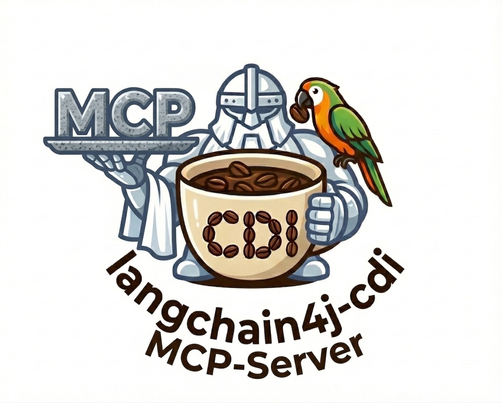
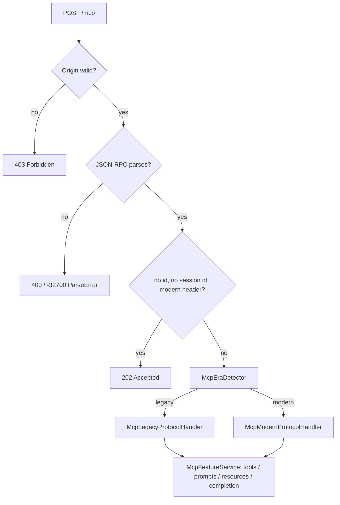
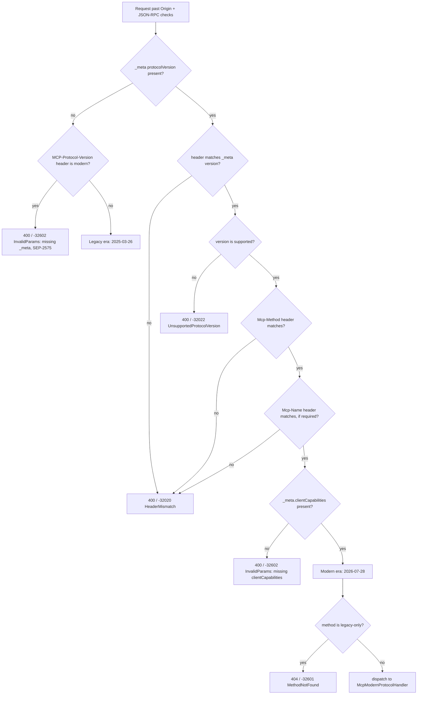
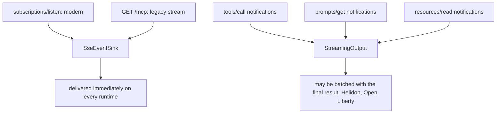
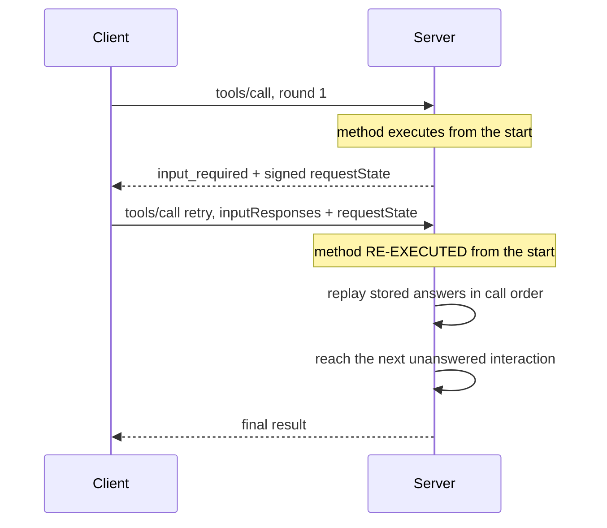
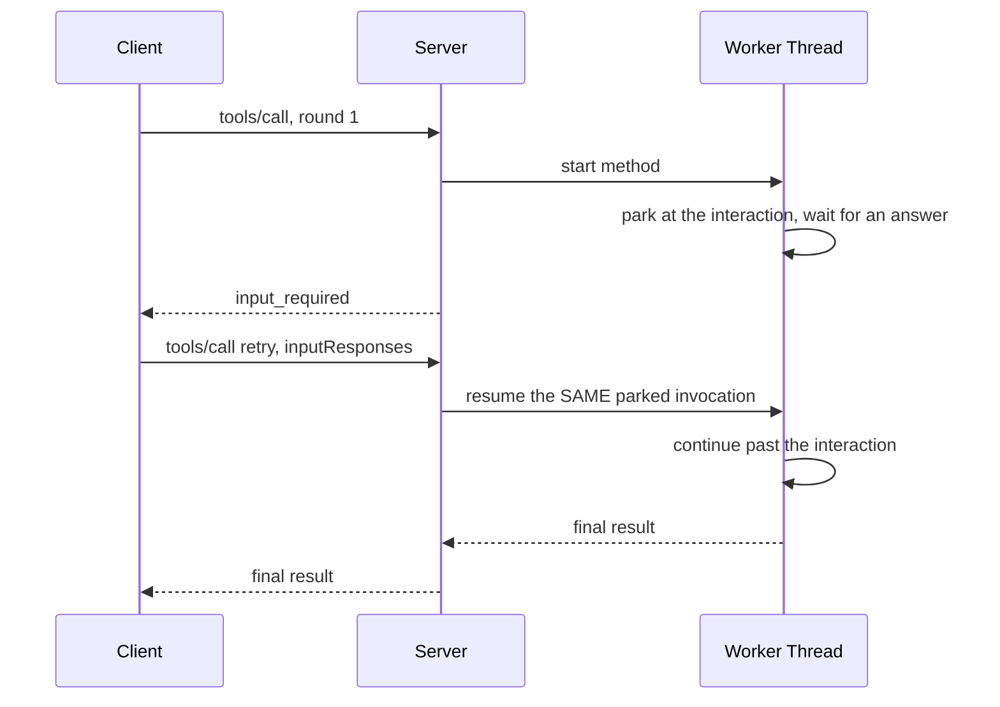
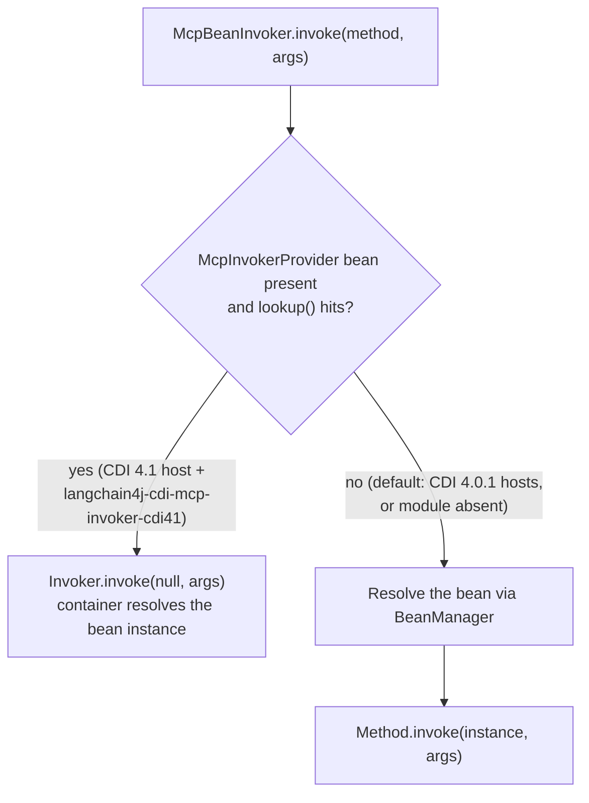

<p align="center">
  
</p>

# LangChain4j CDI — MCP Server

Turn any CDI bean into a [Model Context Protocol (MCP)](https://modelcontextprotocol.io/) server with a few annotations. The server exposes **tools**, **prompts**, and **resources** over HTTP using the Streamable HTTP transport, so any MCP-compatible client (Claude Desktop, VS Code Copilot, custom agents…) can connect to your Jakarta EE / MicroProfile application.

This module builds on the [MCP Java](https://github.com/mcp-java) project, using [java-mcp-annotations](https://github.com/mcp-java/java-mcp-annotations) for the annotation API (`@Tool`, `@Prompt`, `@Resource`, …).

The server is **dual-era**: on the same `/mcp` endpoint it speaks both MCP **2025-03-26** (`initialize` handshake, `Mcp-Session-Id` sessions) and the stateless MCP **2026-07-28** revision (per-request `_meta`, `server/discover`, multi round-trip requests). Each request is routed according to the protocol version it declares, so existing clients keep working while modern clients get the new protocol.

## Table of Contents

- [How It Works](#how-it-works)
- [Getting Started](#getting-started)
  - [1. Add Dependencies](#1-add-dependencies)
  - [2. Write Your First Tool](#2-write-your-first-tool)
  - [3. Run and Connect](#3-run-and-connect)
- [Features](#features)
  - [Tools](#tools)
  - [Prompts](#prompts)
  - [Resources](#resources)
  - [Icons](#icons)
  - [Framework Types (Logging, Progress, Cancellation…)](#framework-types)
  - [Protocol Versions & Compatibility](#protocol-versions--compatibility)
  - [Client Interactions with MCP 2026-07-28](#client-interactions-with-mcp-2026-07-28)
  - [Server Configuration](#server-configuration)
- [Conformance](#conformance)
- [Runtime Support](#runtime-support)
- [Reflection-Free Invocation (CDI 4.1)](#reflection-free-invocation-cdi-41)
- [Module Structure](#module-structure)

---

## How It Works

```
┌──────────────┐        JSON-RPC / HTTP         ┌──────────────────────┐
│  MCP Client  │  ───────────────────────────▶   │  Your Jakarta EE App │
│  (Claude,    │                                 │                      │
│   VS Code…)  │  ◀───────────────────────────   │   @Tool, @Prompt,    │
│              │        SSE notifications        │   @Resource beans    │
└──────────────┘                                 └──────────────────────┘
```

1. You annotate CDI bean methods with `@Tool`, `@Prompt`, or `@Resource`.
2. At deployment time, a CDI extension discovers annotated beans and registers them.
3. A JAX-RS endpoint (`/mcp`) is exposed automatically — it speaks the MCP protocol (JSON-RPC 2.0 over Streamable HTTP).
4. Any MCP client can connect and discover/call your tools, read your resources, and get your prompts.

#### Request Routing

Every request lands on the same `/mcp` endpoint and passes through a fixed pipeline before your bean's code runs: the `Origin` header is checked first, then the body must parse as JSON-RPC, and an id-less, session-less request carrying a modern `MCP-Protocol-Version` header is answered `202` immediately without reaching either era-specific handler. From there, `McpEraDetector` decides whether the legacy or the modern handler processes the request; both delegate the actual tool, prompt, resource and completion execution to the same `McpFeatureService`, which is why a feature behaves identically in both eras.


```mermaid
flowchart TD
    A["POST /mcp"] --> B{"Origin valid?"}
    B -- "no" --> B1["403 Forbidden"]
    B -- "yes" --> C{"JSON-RPC parses?"}
    C -- "no" --> C1["400 / -32700 ParseError"]
    C -- "yes" --> D{"no id, no session id, modern header?"}
    D -- "yes" --> D1["202 Accepted"]
    D -- "no" --> E["McpEraDetector"]
    E -- "legacy" --> F["McpLegacyProtocolHandler"]
    E -- "modern" --> G["McpModernProtocolHandler"]
    F --> H["McpFeatureService: tools / prompts / resources / completion"]
    G --> H
```

---

## Getting Started

### 1. Add Dependencies

Pick the extension that matches your runtime:

**WildFly, Payara, GlassFish, Liberty** (portable extension):

```xml
<dependency>
    <groupId>dev.langchain4j.cdi.mcp</groupId>
    <artifactId>langchain4j-cdi-mcp-server</artifactId>
    <version>1.0.0-Beta1</version>
</dependency>
<dependency>
    <groupId>dev.langchain4j.cdi.mcp</groupId>
    <artifactId>langchain4j-cdi-mcp-portable-ext</artifactId>
    <version>1.0.0-Beta1</version>
</dependency>
```

**Quarkus, Helidon** (build-compatible extension):

```xml
<dependency>
    <groupId>dev.langchain4j.cdi.mcp</groupId>
    <artifactId>langchain4j-cdi-mcp-server</artifactId>
    <version>1.0.0-Beta1</version>
</dependency>
<dependency>
    <groupId>dev.langchain4j.cdi.mcp</groupId>
    <artifactId>langchain4j-cdi-mcp-build-compatible-ext</artifactId>
    <version>1.0.0-Beta1</version>
</dependency>
```

> The `mcp-annotations` and `mcp-server-api` transitive dependencies are pulled in automatically.

### 2. Write Your First Tool

Create a CDI bean and annotate a method with `@Tool`:

```java
import jakarta.enterprise.context.ApplicationScoped;
import org.mcpjava.server.tools.Tool;
import org.mcpjava.server.tools.ToolArg;

@ApplicationScoped
public class WeatherService {

    @Tool(description = "Get the current weather for a city")
    public String getWeather(
            @ToolArg(description = "City name") String city,
            @ToolArg(description = "Unit: celsius or fahrenheit", required = false) String unit) {
        // your real implementation here
        return "Sunny, 22°C in " + city;
    }
}
```

That's it — the method is now callable by any MCP client.

### 3. Run and Connect

Start your application as usual. The MCP endpoint is available at:

```
http://localhost:8080/mcp
```

> The exact URL depends on your application's context root. For example, on WildFly with context root `/my-app`, the URL would be `http://localhost:8080/my-app/mcp`.

To test with `curl` using MCP 2026-07-28 (no session needed):

```bash
curl -s -X POST http://localhost:8080/mcp \
  -H "Content-Type: application/json" \
  -H "MCP-Protocol-Version: 2026-07-28" \
  -H "Mcp-Method: tools/list" \
  -d '{"jsonrpc":"2.0","id":1,"method":"tools/list","params":{"_meta":{
        "io.modelcontextprotocol/protocolVersion":"2026-07-28",
        "io.modelcontextprotocol/clientInfo":{"name":"curl","version":"1.0"},
        "io.modelcontextprotocol/clientCapabilities":{}}}}'
```

Or with the legacy 2025-03-26 handshake:

```bash
# Initialize a session
curl -s -D - -X POST http://localhost:8080/mcp \
  -H "Content-Type: application/json" \
  -d '{"jsonrpc":"2.0","id":1,"method":"initialize","params":{"protocolVersion":"2025-03-26","capabilities":{},"clientInfo":{"name":"curl","version":"1.0"}}}'

# List available tools (use the Mcp-Session-Id from the previous response)
curl -s -X POST http://localhost:8080/mcp \
  -H "Content-Type: application/json" \
  -H "Mcp-Session-Id: <session-id>" \
  -d '{"jsonrpc":"2.0","id":2,"method":"tools/list","params":{}}'
```

---

## Features

### Tools

Tools are methods that an MCP client can call. Think of them as functions exposed to an AI model.

```java
@ApplicationScoped
public class Calculator {

    @Tool(description = "Add two numbers")
    public int add(
            @ToolArg(description = "First number") int a,
            @ToolArg(description = "Second number") int b) {
        return a + b;
    }

    @Tool(description = "Search the company knowledge base")
    public String search(
            @ToolArg(description = "Search query") String query,
            @ToolArg(description = "Max results to return", required = false) Integer limit) {
        // ...
    }
}
```

**Supported parameter types:** `String`, `int`/`Integer`, `long`/`Long`, `double`/`Double`, `float`/`Float`, `boolean`/`Boolean`, enums, arrays, and collections.

**Optional parameters:** Set `required = false` on `@ToolArg` — the parameter will be `null` if the client doesn't provide it.

#### Custom headers (SEP-2243)

MCP 2026-07-28 lets a tool declare, in its JSON Schema, that a client must mirror an argument's value into an HTTP request header on the Streamable HTTP transport. Annotate the parameter with `@McpHeader`:

```java
@Tool(name = "fetch_report", description = "Fetch a tenant's report")
public String fetchReport(
        @ToolArg(name = "tenantId", description = "Tenant identifier") @McpHeader("Tenant-Id") String tenantId,
        @ToolArg(name = "reportId", description = "Report identifier") String reportId) {
    // ...
}
```

The 2026-07-28 `tools/list` then publishes the designation as the `x-mcp-header` keyword, and a conforming client sends the value in `Mcp-Param-Tenant-Id` alongside the JSON-RPC body:

```json
"tenantId": { "type": "string", "description": "Tenant identifier", "x-mcp-header": "Tenant-Id" }
```

The 2025-03-26 legacy era predates SEP-2243 and its output is unchanged — the keyword is omitted there.

SEP-2243 puts four constraints on the value; all are checked when the tool is registered, and a violation **fails the deployment** with a message naming the tool, the parameter and the rule:

| Rule | Rejected example |
|---|---|
| must not be empty | `@McpHeader("")` |
| ASCII only, no space, no `:` | `@McpHeader("X Tenant")`, `@McpHeader("X:Tenant")` |
| case-insensitively unique within one tool | two arguments designating `Tenant-Id` and `tenant-id` |
| `integer`, `string` or `boolean` only — `number` is **not** permitted | `@McpHeader("X-Amount") double amount` |

Failing at deployment is deliberate: a client MUST *exclude* a tool whose designation is invalid from `tools/list`, so a malformed value produces no error anywhere — the tool simply vanishes from the client's catalogue.

On the request side, the 2026-07-28 endpoint **validates the headers a client mirrors back** before it dispatches `tools/call`. For every designated argument, `Mcp-Param-<designation>` must agree with the request body; a disagreement is answered **HTTP 400** with JSON-RPC error **`-32020` (HeaderMismatch)** and the tool is never invoked:

| Case | Outcome |
|---|---|
| header and body agree (after decoding) | accepted |
| header carries `=?base64?<payload>?=` that decodes to the body value | accepted — an integer is compared as its decimal string, a boolean as lowercase `true`/`false` |
| value missing either `=?base64?` or `?=` | compared **literally**, not decoded |
| header and body disagree (comparison is case-sensitive) | 400 / `-32020` |
| body carries the argument, header omitted | 400 / `-32020` |
| header present, argument absent or `null` in the body | 400 / `-32020` |
| header carries a malformed Base64 payload (bad padding, non-alphabet characters) | 400 / `-32020` — never a 500 |
| argument absent or `null` in the body **and** header omitted | accepted |

A tool that designates no argument is never inspected, and an `Mcp-Param-*` header whose designation the tool does not declare is ignored. The 2025-03-26 legacy era reads no `Mcp-Param-*` header at all.

Note that `Base64.getDecoder()` accepts an unpadded payload, so `=?base64?SGVsbG8?=` would silently decode to `Hello`; SEP-2243's conformance test-case table requires rejection, so the payload's alphabet, length and padding are checked before it is decoded.

Do not designate sensitive arguments (passwords, API keys, tokens, PII): the value travels in a header, where intermediaries can read and log it.

> `@McpHeader` is **provisional** and the only user-facing annotation this module defines outside `org.mcpjava`. `org.mcpjava:mcp-server-api` has no hook for the designation (`@ToolArg` exposes only `name`, `description`, `required`, `defaultValue`); the annotation is intended to migrate upstream if that project adopts SEP-2243.

#### Title and annotations

`@Tool` carries `title()` and `annotations()` (`Tool.Annotations`, with `readOnlyHint`, `destructiveHint`, `idempotentHint`, `openWorldHint`); both are published on `tools/list`:

```java
@Tool(
        name = "delete_report",
        title = "Delete Report",
        description = "Permanently deletes a report",
        annotations = @Tool.Annotations(readOnlyHint = false, destructiveHint = true, idempotentHint = true))
public void deleteReport(@ToolArg(name = "reportId") String reportId) {
    // ...
}
```

A Java annotation element cannot distinguish "left unspecified" from "explicitly set to the default", so a hint is published only when it **differs** from the MCP spec default (`readOnlyHint=false`, `destructiveHint=true`, `idempotentHint=false`, `openWorldHint=true`; `title=""`). A tool whose annotation members all equal their default — including one that never mentions `annotations` at all — omits the `annotations` key entirely rather than emitting values that would assert something the tool author never wrote; likewise an empty `title` is omitted. Both `title` and `annotations` are 2026-07-28-only: the 2025-03-26 legacy era's `tools/list` output is unchanged, byte for byte, even though its `Tool` schema technically permits `annotations` too — that invariant is promised by the upstream PR this module tracks.

> `Tool.structuredContent()` and `Tool.outputSchemaFrom()` also exist upstream and are not read by this module.

#### Hand-written input schema

`JsonSchemaGenerator` only ever derives a flat `properties`/`required` object from a Java signature — it cannot emit composition (`oneOf`/`anyOf`/`allOf`/`not`), conditional (`if`/`then`/`else`), or reference (`$ref`/`$defs`/`$anchor`) keywords, none of which has a signature counterpart. `@McpInputSchema` supplies a literal JSON Schema 2020-12 document instead, published verbatim, identically, in both protocol eras:

```java
@Tool(name = "example", description = "A tool with a hand-written input schema")
@McpInputSchema("""
        {
          "type": "object",
          "properties": { "name": { "type": "string" } },
          "required": ["name"]
        }
        """)
public String example(@ToolArg(name = "name") String name) {
    // ...
}
```

Three rules are enforced **when the tool is registered**, failing the deployment with a message naming the tool and the rule:

| Rule | Rejected example |
|---|---|
| the root must be a JSON object with `"type": "object"` | `@McpInputSchema("{\"type\":\"array\"}")` |
| every property in a top-level `required` array must have a same-named, bindable Java parameter | `"required": ["missingParam"]` with no `missingParam` parameter |
| must not be combined with `@McpHeader` on the same method | a parameter carrying both `@McpHeader` and a method carrying `@McpInputSchema` |

The third rule is a deliberate design choice, not a limitation: SEP-2243 request validation reads header designations from the reflected `@McpHeader` annotations, independently of whatever the hand-written schema says. A schema a tool author forgets to keep in sync — or one written before a later `@McpHeader` addition — would validate `Mcp-Param-*` headers the client was never told to send, because the client only ever learns about a designation from the `x-mcp-header` keyword the *schema* carries. Rejecting the combination removes that entire class of drift.

A tool that does not use `@McpInputSchema` keeps exactly the generated schema it always had, in both eras, byte for byte.

> `@McpInputSchema` is **provisional**, following the `@McpHeader` precedent: `org.mcpjava:mcp-server-api` has no hook for a hand-written input schema at all, so the mechanism lives here and is intended to migrate to (or be superseded by) an upstream one, should `org.mcpjava` adopt a feature like it.

### Prompts

Prompts are reusable templates that guide how an AI model should respond. They are returned as structured messages.

```java
@ApplicationScoped
public class MyPrompts {

    @Prompt(description = "Summarize the given text concisely")
    public String summarize(
            @PromptArg(description = "The text to summarize") String text) {
        return "Please summarize the following text in 3 bullet points:\n\n" + text;
    }

    @Prompt(description = "Translate text to a target language")
    public String translate(
            @PromptArg(description = "Text to translate") String text,
            @PromptArg(description = "Target language") String language) {
        return "Translate the following to " + language + ":\n\n" + text;
    }
}
```

### Resources

Resources expose read-only data that clients can retrieve. Each resource has a unique URI.

```java
@ApplicationScoped
public class AppResources {

    @Resource(
            uri = "config://app",
            name = "Application Config",
            description = "Current application configuration",
            mimeType = "application/json")
    public String getConfig() {
        return "{\"version\": \"2.1\", \"environment\": \"production\"}";
    }

    @Resource(
            uri = "data://metrics",
            name = "System Metrics",
            description = "Current system health metrics")
    public String getMetrics() {
        return "cpu=45%, memory=72%, uptime=48h";
    }
}
```

Clients can also **subscribe** to resources and receive notifications when the data changes.

A `@ResourceTemplate` serves a whole family of URIs. The `{variable}` expressions of the URI template (RFC 6570 level 1) are matched against the requested URI and bound to the method's parameters by name:

```java
@ResourceTemplate(
        uriTemplate = "user://{userId}/profile",
        name = "User Profile",
        mimeType = "application/json")
public String userProfile(@ResourceTemplateArg(name = "userId") String userId) {
    return repository.profileJson(userId);
}
```

`resources/read` resolves an exactly registered `@Resource` URI first and falls back to the templates; when several templates match, the most specific one wins (fewest variables, then the longest template). A variable in the middle of the template matches one path segment, a variable ending it matches the rest of the URI.

> **Caveat:** a variable that *ends* the template deliberately captures the rest of the URI, slashes included, so `file:///{path}` matches `file:///a/b/c.txt` with `path = "a/b/c.txt"`. Strict RFC 6570 level-1 expansion percent-encodes `/` and would never produce such a URI, so this is a deliberate convenience: a template ending in a variable is greedy, and one that should only match a single segment must be written with something after it (`file:///{name}/content`). Variable values are percent-decoded; a value that is not valid percent-encoding (`100%`, `a%zz`) is passed through unchanged rather than rejected.

> Without `@ResourceTemplateArg(name = …)` — and likewise without `@ToolArg(name = …)` / `@PromptArg(name = …)` — arguments are named after the Java parameter, which requires the module holding your beans to be **compiled with `-parameters`**; otherwise they are advertised and bound as `arg0`, `arg1`, … Set `<maven.compiler.parameters>true</maven.compiler.parameters>` in your application's POM.

### Icons

Tools, prompts, resources and resource templates can advertise icons a client renders next to them. The contract is the upstream one from `org.mcpjava:mcp-server-api` — there is no annotation of our own:

```java
@Icons(iconProvider = BrandIcons.class)          // on the type: covers every feature the bean declares
@ApplicationScoped
public class WeatherTool {

    @Tool(description = "Get the current weather for a given city")
    @Icons(iconProvider = WeatherIcons.class)    // on the method: wins over the type-level one
    public String getWeather(String city) { … }
}

@ApplicationScoped                               // a CDI bean, or any class with a no-arg constructor
public class WeatherIcons implements IconProvider {

    @Override
    public List<Icon> getIcons(FeatureType featureType, String name) {
        return List.of(Icon.builder("https://example.org/weather.png")
                .setMimeType("image/png")
                .addSize(48, 48)
                .setTheme(Icon.Theme.LIGHT)
                .build());
    }
}
```

- **Where `@Icons` is accepted** — exactly where the annotation's `@Target({TYPE, METHOD})` allows it: on the feature method, and on the class declaring it. The method-level annotation wins; otherwise the CDI bean class is consulted, then the method's declaring class (they differ for an inherited feature).
- **How the provider is resolved** — as a CDI bean when the container knows one, otherwise through its no-argument constructor. `getIcons` is called **once, at registration time**, with the feature's `FeatureType` and its registered **name** (for a resource that is the `name`, not the `uri`, as the `IconProvider` javadoc specifies).
- **Failures break the deployment.** A provider that cannot be resolved, is ambiguous, cannot be instantiated, throws, or returns an icon without a `src` raises `McpIconProviderException` while the feature is being registered, with a message naming the feature and the provider class. Icons are optional everywhere in the schema, so a call-time failure would silently drop them from the client's catalogue instead.
- **No icons means no key.** A provider returning `null` or an empty list emits no `icons` member at all, never an empty array. Optional icon members (`mimeType`, `sizes`, `theme`) are likewise omitted when unset.
- **2026-07-28 only.** `icons` exists on `Tool`, `Prompt`, `Resource` and `ResourceTemplate` in the 2026-07-28 schema and in none of the 2025-03-26 definitions, so the legacy era's listings are unchanged — byte for byte.

```jsonc
// tools/list, MCP 2026-07-28
{ "description": "Get the current weather for a given city",
  "icons": [ { "mimeType": "image/png", "sizes": ["48x48"],
               "src": "https://example.org/weather.png", "theme": "light" } ],
  "inputSchema": { … },
  "name": "getWeather" }
```

> **Caveat (Quarkus):** `Icon.of(…)` / `Icon.builder(…)` go through `org.mcpjava.server.spi.McpServerSPILoader`, which loads the SPI with `McpServerSPI.class.getClassLoader()`. Under Quarkus the API jar sits in the base runtime class loader while `langchain4j-cdi-mcp-server` (which carries the `META-INF/services` entry) is an application archive in the child loader, so the lookup fails with `No McpServerSPI implementation found`. This is an upstream loader limitation shared by every `org.mcpjava` static factory (`ToolResponse.builder()`, `TextContent.of()`, …), not something specific to icons; until it is fixed upstream, a Quarkus provider can implement the four-method `Icon` interface directly.

### Framework Types

You can inject special MCP framework types as parameters in any `@Tool`, `@Prompt`, or `@Resource` method. These are resolved automatically at invocation time and do **not** appear in the generated JSON Schema.

```java
@Tool(description = "Long-running data import")
public String importData(
        @ToolArg(description = "File path") String path,
        Progress progress,          // report progress to the client
        Cancellation cancellation,  // check if the client cancelled
        McpLog log) {               // send log messages to the client

    log.info("Starting import of " + path);

    for (int i = 0; i < 100; i++) {
        if (cancellation.check().isRequested()) {
            return "Import cancelled at " + i + "%";
        }
        // ... process chunk ...
        progress.notification(i, 100, "Processing...").send();
    }

    return "Import complete";
}
```

| Type | Package | Description |
|------|---------|-------------|
| `McpLog` | `dev.langchain4j.cdi.mcp.server.api` | Send log messages (`debug`, `info`, `warning`, `error`) to the client (MCP 2026-07-28: only when the request sets a log level) |
| `Progress` | `org.mcpjava.server.progress` | Report progress for long-running operations |
| `Cancellation` | `org.mcpjava.server` | Check if the client has cancelled the current request |
| `McpConnection` | `dev.langchain4j.cdi.mcp.server.api` | Access session (legacy) or per-request client information (MCP 2026-07-28) |
| `Roots` | `dev.langchain4j.cdi.mcp.server.api` | Access the client's file system roots |
| `Sampling` | `dev.langchain4j.cdi.mcp.server.api` | Request LLM completions from the client |
| `Elicitation` | `dev.langchain4j.cdi.mcp.server.api` | Request user input from the client |

`Roots` and `Sampling` hand back wire-format records from `dev.langchain4j.cdi.mcp.server.protocol` (`McpRoot`,
`McpSamplingMessage`, `McpModelPreferences`).

### Server Identity

The server name and version advertised to clients during `initialize` default to `langchain4j-cdi` / `unknown`.
Produce a `@Named("mcp-server")` `McpServerConfig` bean to override them:

```java
import dev.langchain4j.cdi.mcp.server.transport.McpServerConfig;

@Produces
@ApplicationScoped
@Named("mcp-server")
public McpServerConfig mcpServerConfig() {
    return McpServerConfig.builder()
            .serverName("car-booking")
            .serverVersion("1.0.0")
            .build();
}
```

### Java Module (JPMS) Consumers

On a strict module path, `requires dev.langchain4j.cdi.mcp.server;` is enough: the module exports
`…server.api`, `…server.protocol`, `…server.registry` and `…server.transport`. Everything else
(`…server.error`, `…server.logging`, `…server.schema`, `…server.spi`) is internal and intentionally not
exported. The `langchain4j-cdi-jlink` module compiles a stand-in consumer against this surface on every
`-Pjlink-vidocq verify` run, so an export that goes missing fails the build.

### Protocol Versions & Compatibility

| | MCP 2025-03-26 (legacy) | MCP 2026-07-28 (modern) |
|---|---|---|
| Detection | no `_meta.io.modelcontextprotocol/protocolVersion` in the request | `_meta` version + matching `MCP-Protocol-Version` header |
| Handshake | `initialize` → `Mcp-Session-Id` | none; `server/discover` is optional |
| Required headers | `Mcp-Session-Id` | `MCP-Protocol-Version`, `Mcp-Method`, `Mcp-Name` (`tools/call`, `prompts/get`, `resources/read`) |
| Change notifications | `GET /mcp` SSE stream + `resources/subscribe` | `subscriptions/listen` |
| Elicitation / sampling / roots | server-initiated requests on the GET stream | multi round-trip requests (`input_required` results) |
| Logging | `logging/setLevel` (global) | `io.modelcontextprotocol/logLevel` per request |
| Errors | HTTP 200 + JSON-RPC error; HTTP 400 for a request without a session id, HTTP 404 for one carrying an unknown or terminated session id | HTTP 400 for `InvalidParams` (-32602) on a missing or incomplete `_meta`, `HeaderMismatch` (-32020), `MissingRequiredClientCapability` (-32021), `UnsupportedProtocolVersion` (-32022); HTTP 404 for unknown methods |
| Notification POSTs | HTTP 202 Accepted, empty body | HTTP 202 Accepted, empty body |
| Caching hints | none | `ttlMs` / `cacheScope` (SEP-2549) on `server/discover` and on every cacheable result (`tools/list`, `prompts/list`, `resources/list`, `resources/templates/list`, `resources/read`) |

#### Era Detection

`McpEraDetector` classifies each request by looking for a `protocolVersion` field inside `_meta.io.modelcontextprotocol`. Its absence sends the request to the legacy 2025-03-26 era, unless the `MCP-Protocol-Version` header itself claims a modern version — then the missing `_meta` is malformed input, not a fallback trigger, and the server answers `400` / `-32602` (SEP-2575). When `_meta.protocolVersion` is present, the checks run in a fixed order: the header must agree with it first (`-32020` on any mismatch), then the version must be one the server supports (`-32022`), then the `Mcp-Method` and `Mcp-Name` headers must match the request (`-32020`), and only last is `_meta.clientCapabilities` required (`-32602`) before the request reaches the modern handler. A modern request naming a legacy-only method (`initialize`, `logging/setLevel`, …) is rejected too, but only once dispatch reaches the method switch, which is why it surfaces as `404` / `-32601` rather than a header-level error.


```mermaid
flowchart TD
    A["Request past Origin + JSON-RPC checks"] --> B{"_meta protocolVersion present?"}
    B -- "no" --> B1{"MCP-Protocol-Version header is modern?"}
    B1 -- "yes" --> B2["400 / -32602 InvalidParams: missing _meta, SEP-2575"]
    B1 -- "no" --> B3["Legacy era: 2025-03-26"]
    B -- "yes" --> C{"header matches _meta version?"}
    C -- "no" --> C1["400 / -32020 HeaderMismatch"]
    C -- "yes" --> D{"version is supported?"}
    D -- "no" --> D1["400 / -32022 UnsupportedProtocolVersion"]
    D -- "yes" --> E{"Mcp-Method header matches?"}
    E -- "no" --> C1
    E -- "yes" --> F{"Mcp-Name header matches, if required?"}
    F -- "no" --> C1
    F -- "yes" --> G{"_meta.clientCapabilities present?"}
    G -- "no" --> G1["400 / -32602 InvalidParams: missing clientCapabilities"]
    G -- "yes" --> H["Modern era: 2026-07-28"]
    H --> I{"method is legacy-only?"}
    I -- "yes" --> I1["404 / -32601 MethodNotFound"]
    I -- "no" --> J["dispatch to McpModernProtocolHandler"]
```

`server/discover` advertises `supportedVersions: ["2026-07-28", "2025-03-26"]`. A modern request with another version is rejected with `UnsupportedProtocolVersion` listing these versions, and dual-era clients (such as `langchain4j-mcp` 1.19+) fall back automatically.

The server validates the `Origin` header on every request (DNS rebinding protection). Requests without `Origin` (non-browser clients) are accepted. With the default empty `allowedOrigins`, a request with an `Origin` is accepted only when both the `Origin` host and the `Host` header host are loopback (`localhost`, `127.0.0.1`, `::1`); any other origin — including one matching the `Host` header, which is exactly what a DNS rebinding attack sends — gets HTTP 403. When the server is reached from browsers through a real host name, list the accepted origins in `allowedOrigins` (see [Server Configuration](#server-configuration)).

> **Breaking change:** `McpEndpoint` is container-managed. Its public constructor and its resource method signatures (`handlePost`, `handleGet`, `handleDelete`) changed: code that subclassed `McpEndpoint` or invoked these methods directly must be updated.

> **Breaking change — legacy-era HTTP status codes.** Two legacy (2025-03-26) responses changed to the status the Streamable HTTP transport requires, and clients that hard-coded the old ones must be updated:
>
> - A `POST /mcp` whose body is only JSON-RPC **notifications or responses** now answers **202 Accepted** with an empty body instead of 200. This is not cosmetic: the MCP TypeScript SDK opens the standalone `GET /mcp` notification stream only when `notifications/initialized` is answered exactly 202, so with 200 no server-initiated elicitation, sampling, log or progress message ever reached such a client.
> - A request carrying an unknown or **terminated** session id now answers **404 Not Found** (still with the `-32001` JSON-RPC error body) instead of 200. A request carrying *no* session id stays a 400 Bad Request.

#### Known limitations

Not every server-to-client push travels the same way. The two long-lived streams — `subscriptions/listen` and the legacy `GET /mcp` notification stream — are written through the Jakarta REST `SseEventSink` API, which the runtime flushes after every event, so delivery is immediate everywhere. Request-scoped notifications emitted during a `tools/call`, `prompts/get` or `resources/read` reply instead go through a plain `StreamingOutput`, which some runtimes buffer.


```mermaid
flowchart TD
    A["subscriptions/listen: modern"] --> S["SseEventSink"]
    B["GET /mcp: legacy stream"] --> S
    S --> S1["delivered immediately on every runtime"]
    C["tools/call notifications"] --> O["StreamingOutput"]
    D["prompts/get notifications"] --> O
    E["resources/read notifications"] --> O
    O --> O1["may be batched with the final result: Helidon, Open Liberty"]
```

- **Request-scoped notifications may be batched on some runtimes.** Progress (`Progress`) and log (`McpLog`) notifications emitted during a modern `tools/call`, `prompts/get` or `resources/read` streamed reply go through `StreamingOutput`, and Helidon (Jersey output buffering, ~8 KB) and Open Liberty (~32 KB) may hold them until the final result is written before the client sees any of it.
- **Quarkus SSE framing/headers on sink streams.** On Quarkus, the `subscriptions/listen` and legacy `GET /mcp` streams are written as `data:{...}` (no space, valid SSE) and do not carry the `Cache-Control`, `X-Accel-Buffering` and `Mcp-Session-Id` response headers. If a reverse proxy buffers SSE, configure it to disable buffering for `/mcp`.
- **Deprecated spec features still supported.** MCP 2026-07-28 deprecates Roots, Sampling and Logging: they keep working but new servers should prefer tool arguments, direct LLM calls and OpenTelemetry.

### Client Interactions with MCP 2026-07-28

`Elicitation`, `Sampling` and `Roots` keep the same blocking Java API (`sendAndAwait()`, `listAndAwait()`) in both eras. With modern clients, the server cannot send its own requests: it answers `input_required`, and the client retries the call with the answers (*multi round-trip requests*). Two strategies are available through `McpServerConfig.mrtrMode`:

| Mode | How it works | Constraints |
|---|---|---|
| `REPLAY` (default) | The method is **re-executed from the beginning** on each retry. Answers already given are replayed in call order; they travel in a signed, expiring `requestState`. | Code executed before an interaction must be idempotent, and interactions must happen in a deterministic order. Stateless: works behind any load balancer if all instances share `requestStateSecret`. |
| `CONTINUATION` | The first call starts the method on a worker thread which waits for the answer; retries resume it. | In-memory state: requires sticky routing in a cluster. `@RequestScoped` beans are not active on the worker thread. Each round must complete within `continuationTimeout`. A round that exceeds `continuationTimeout` fails the request, but a compute-bound method is not interrupted (it keeps its worker thread until it returns). Worker threads come from an unbounded cached pool: size `continuationTimeout` accordingly and prefer `REPLAY` for public-facing servers. The log-level threshold of the first round applies to all rounds (progress tokens, cancellation and whether logs are sent at all follow each round). |

#### On The Wire

**`REPLAY`** — the retry is not a continuation of the first call, it is a brand new invocation: the method body starts over at line one, and every previously answered interaction is satisfied from the replayed `requestState` before execution reaches the next one. This is the property to design for: any code before an interaction runs again on every round, so it must be safe to repeat.


```mermaid
sequenceDiagram
    participant Client
    participant Server
    Client->>Server: tools/call, round 1
    Note over Server: method executes from the start
    Server-->>Client: input_required + signed requestState
    Client->>Server: tools/call retry, inputResponses + requestState
    Note over Server: method RE-EXECUTED from the start
    Server->>Server: replay stored answers in call order
    Server->>Server: reach the next unanswered interaction
    Server-->>Client: final result
```

**`CONTINUATION`** — the opposite trade-off: the same worker thread stays parked at the exact point of the interaction, so the retry resumes execution rather than replaying it. Nothing runs twice, but the parked thread and its `@RequestScoped` state must survive until the client answers.


```mermaid
sequenceDiagram
    participant Client
    participant Server
    participant Worker as Worker Thread
    Client->>Server: tools/call, round 1
    Server->>Worker: start method
    Worker->>Worker: park at the interaction, wait for an answer
    Server-->>Client: input_required
    Client->>Server: tools/call retry, inputResponses
    Server->>Worker: resume the SAME parked invocation
    Worker->>Worker: continue past the interaction
    Worker-->>Server: final result
    Server-->>Client: final result
```

```java
@Tool(description = "Book a car after confirming the dates")
public String book(@ToolArg(description = "Car id") String carId, Elicitation elicitation) {
    // REPLAY mode: this line runs again on the retry, keep it side-effect free
    Car car = catalog.find(carId);
    ElicitationResponse answer = elicitation.requestBuilder()
            .setMessage("Rent " + car.name() + "? Enter the start date")
            .addSchemaProperty("startDate", () -> Map.of("type", "string", "format", "date"))
            .build()
            .sendAndAwait();
    if (answer.action() != ElicitationResponse.Action.ACCEPT) {
        return "Booking cancelled";
    }
    // side effects after the last interaction run exactly once
    return bookings.create(car, answer.content().getString("startDate"));
}
```

If the client did not declare the needed capability (`elicitation`, `sampling`, `roots`) in `_meta.io.modelcontextprotocol/clientCapabilities`, the call fails with `MissingRequiredClientCapability`; check `elicitation.isSupported()` first to degrade gracefully. Note that MCP 2026-07-28 deprecates Roots, Sampling and Logging: they keep working but new servers should prefer tool arguments, direct LLM calls and OpenTelemetry.

#### Choosing the input-request key (SEP-2322)

By default, each client interaction is published in `inputRequests`/looked up in `inputResponses` under a key the
server assigns by call order (`input-0`, `input-1`, …). Call `setKey(String)` on the `ElicitationRequest.Builder` or
`SamplingRequest.Builder`, or use `Roots.listAndAwait(String key)`, to publish it under a key of your choosing
instead — useful when a client needs to recognise a specific field (e.g. `user_name`) across retries:

```java
ElicitationResponse answer = elicitation.requestBuilder()
        .setMessage("What is your name?")
        .setKey("user_name")
        .build()
        .sendAndAwait();
```

The key must not be blank; `build()` rejects a blank key. A response for a key the server never requested is
ignored. This works identically in both `REPLAY` and `CONTINUATION` mode, and is a no-op with legacy (2025-03-26)
clients, which have no MRTR and no `inputRequests`/`inputResponses` concept.

With modern clients, `McpLog` messages and `Progress` notifications are sent on the SSE response stream of the current request only, and log messages only when the request carried `io.modelcontextprotocol/logLevel`.

### Server Configuration

Provide an optional `McpServerConfig` bean named `mcp-server`:

```java
@ApplicationScoped
public class McpConfigProducer {

    @Produces
    @Named("mcp-server")
    @ApplicationScoped
    McpServerConfig mcpServerConfig() {
        return McpServerConfig.builder()
                .serverName("car-booking")
                .serverVersion("1.0.0")
                .allowedOrigins(List.of("https://app.example.com"))
                .mrtrMode(McpMrtrMode.REPLAY)
                .requestStateSecret(System.getenv("MCP_REQUEST_STATE_SECRET")) // >= 32 characters
                .requestStateTtl(Duration.ofMinutes(10))
                .continuationTimeout(Duration.ofMinutes(5))
                .cacheTtl(Duration.ofMinutes(5))
                .cacheScope("public")
                .build();
    }
}
```

| Property | Default | Description |
|---|---|---|
| `serverName` / `serverVersion` | `langchain4j-cdi` / `unknown` | Returned in `initialize` and in `_meta.io.modelcontextprotocol/serverInfo` |
| `allowedOrigins` | empty (loopback `Origin` on a loopback `Host` only) | Accepted `Origin` values; `*` accepts all |
| `mrtrMode` | `REPLAY` | Strategy for client interactions with MCP 2026-07-28 clients |
| `requestStateSecret` | random per JVM | HMAC key protecting `requestState`; **set it when running several instances** |
| `requestStateTtl` | 10 minutes | Validity of a `requestState` |
| `continuationTimeout` | 5 minutes | `CONTINUATION` mode: maximum wait for a client answer or for the method to finish |
| `cacheTtl` | 0 (immediately stale) | SEP-2549 `ttlMs` emitted on `server/discover` and on every cacheable MCP 2026-07-28 result; raise it when your tool/prompt/resource catalogue is stable |
| `cacheScope` | `public` | SEP-2549 `cacheScope` emitted on the same results; use `private` when a result depends on the caller's authorization context |

---

## Conformance

The server is measured against the official [`@modelcontextprotocol/conformance`](https://github.com/modelcontextprotocol/conformance) suite by the `langchain4j-cdi-mcp-conformance` fixture application (a Helidon MP app serving `/mcp` on port 8080, built with `mvn package`, run with `java -jar target/langchain4j-cdi-mcp-conformance.jar`).

| Run | Score |
|---|---|
| `--spec-version 2026-07-28 --suite all` | **146 passed, 2 failed** |
| `--spec-version 2025-11-25 --suite all` | **81 passed, 0 failed** |
| `@0.1.16` (stable line, default suite) | **40 passed, 0 failed** |

```bash
npx -y @modelcontextprotocol/conformance@alpha server --url http://localhost:8080/mcp \
    --spec-version 2026-07-28 --suite all --expected-failures conformance-baseline.yml
npx -y @modelcontextprotocol/conformance@alpha server --url http://localhost:8080/mcp \
    --spec-version 2025-11-25 --suite all --expected-failures conformance-baseline-legacy.yml
npx -y @modelcontextprotocol/conformance@0.1.16 server --url http://localhost:8080/mcp \
    --expected-failures conformance-baseline-legacy.yml
```

`--suite all` is required: the default `active` suite runs 20 scenarios and silently skips the entire 2026-07-28 surface, including all 15 multi-round-trip (`input-required-result-*`) scenarios.

### Known gaps

The remaining failures are missing features and API limitations, not protocol bugs. They are listed in `conformance-baseline.yml` / `conformance-baseline-legacy.yml`, so a regression anywhere else fails the gate.

- **One pending input request per round** — the blocking `sendAndAwait()` API suspends the method at its first interaction, so an `input_required` result always carries a single `inputRequests` entry. Asking several questions in one round trip needs a batch interaction API.
- **Tasks extension** — not implemented.

---

## Runtime Support

| Runtime | Extension Module | How It Works |
|---------|-----------------|--------------|
| **Quarkus** | `langchain4j-cdi-mcp-build-compatible-ext` | Discovers annotations at build time for fast startup |
| **Helidon** | `langchain4j-cdi-mcp-build-compatible-ext` | Same build-compatible extension |
| **WildFly** | `langchain4j-cdi-mcp-portable-ext` | Discovers annotations at deployment time via CDI portable extension |
| **Payara** | `langchain4j-cdi-mcp-portable-ext` | Same portable extension |
| **GlassFish** | `langchain4j-cdi-mcp-portable-ext` | Same portable extension |
| **Liberty** | `langchain4j-cdi-mcp-portable-ext` | Same portable extension |

### Open Liberty / WebSphere Liberty

The MCP endpoint is a **JAX-RS resource** (`@Path("/mcp")`), not a servlet. On Liberty two extra steps are required beyond adding the dependencies — without them the `initialize` request returns **`404 - SRVE0190E: File not found: /mcp`**.

> ⚠️ **Do not confuse this with Liberty's built-in `mcpServer-1.0` feature.** That feature is Liberty's own, unrelated MCP implementation. This module brings its own MCP server over JAX-RS, so `mcpServer-1.0` must **not** be enabled — it is neither used nor required here.

**1. Enable the required features** in `server.xml`:

```xml
<featureManager>
    <feature>restfulWS-3.1</feature> <!-- exposes the /mcp JAX-RS endpoint; pulls in servlet and cdi transitively -->
    <feature>jsonb-3.0</feature>         <!-- used to serialize MCP responses -->
</featureManager>
```

**2. Provide a JAX-RS `Application`** in your application. Liberty does **not** scan `@Path` resources packaged inside `WEB-INF/lib` JARs (where `langchain4j-cdi-mcp-server` lives) unless the application declares an `Application` class, so you must add one:

```java
import jakarta.ws.rs.ApplicationPath;
import jakarta.ws.rs.core.Application;

@ApplicationPath("/")
public class RestApplication extends Application {}
```

With the context root set to `/`, the endpoint is then reachable at `http://<host>:<port>/mcp`. Use a different `@ApplicationPath` (or context root) to relocate it.

---

## Reflection-Free Invocation (CDI 4.1)

By default, every `@Tool`/`@Prompt`/`@Resource` method call goes through `Method.invoke` after the target CDI bean is resolved from the `BeanManager`. On a CDI 4.1 host, the optional `langchain4j-cdi-mcp-invoker-cdi41` module replaces that with the standard [CDI 4.1 invoker API](https://jakarta.ee/specifications/cdi/4.1/) (`jakarta.enterprise.invoke.Invoker`), so the container builds and resolves the call site itself — no reflective invocation, no `setAccessible`, and no CDI bean lookup on the server's side. Because the call site is known at build time, this also keeps tool invocation free of reflection metadata for ahead-of-time compilation (GraalVM native image, Project Leyden) — note, however, that native image is listed under *Known untested areas* below: the benefit is structural, not measured here.


```mermaid
flowchart TD
    A["McpBeanInvoker.invoke(method, args)"] --> B{"McpInvokerProvider bean present\nand lookup() hits?"}
    B -- "yes (CDI 4.1 host +\nlangchain4j-cdi-mcp-invoker-cdi41)" --> C["Invoker.invoke(null, args)\ncontainer resolves the bean instance"]
    B -- "no (default: CDI 4.0.1 hosts,\nor module absent)" --> D["Resolve the bean via BeanManager"]
    D --> E["Method.invoke(instance, args)"]
```

**How it works:** `langchain4j-cdi-mcp-server` defines two container-agnostic SPI types (package `dev.langchain4j.cdi.mcp.server.registry`, CDI 4.0.1, no `jakarta.enterprise.invoke` import — the type is named only in Javadoc prose): `McpMethodInvoker` (the call) and `McpInvokerProvider` (the lookup). `McpBeanInvoker` injects every `McpInvokerProvider` bean present, caches the lookup per (bean class, `java.lang.reflect.Method`) pair — the method alone is not enough, since an annotated method inherited from a common base yields equal `Method` objects for two different beans — and falls back to reflection whenever no provider is present or none has an invoker for that method. The `langchain4j-cdi-mcp-invoker-cdi41` module implements that SPI: its Build Compatible Extension (`McpInvokerBuildCompatibleExtension`) asks the container's `InvokerFactory` for an `Invoker` built with `withInstanceLookup()` for every annotated method, in the `@Registration` phase, and registers a synthetic `@ApplicationScoped` bean (`McpCdi41InvokerProvider`) that exposes them under the `McpInvokerProvider` type, in the `@Synthesis` phase.

**How to use it:** add the dependency next to `langchain4j-cdi-mcp-server` — nothing else to configure:

```xml
<dependency>
    <groupId>dev.langchain4j.cdi.mcp</groupId>
    <artifactId>langchain4j-cdi-mcp-server</artifactId>
    <version>1.0.0-Beta1</version>
</dependency>
<dependency>
    <groupId>dev.langchain4j.cdi.mcp</groupId>
    <artifactId>langchain4j-cdi-mcp-invoker-cdi41</artifactId>
    <version>1.0.0-Beta1</version>
    <scope>runtime</scope>
</dependency>
```

The core MCP modules keep `jakarta.enterprise.cdi-api` **4.0.1** (Jakarta EE 10); adding this module is your explicit opt-in to a CDI 4.1 host, and it changes nothing for anyone who does not add it.

> ⚠️ **CDI 4.1 is a hard prerequisite, not a soft one.** On a CDI 4.0 host this module does not degrade to reflection — it breaks the deployment, because a CDI 4.0 container can neither load nor dispatch to a Build Compatible Extension that declares an `InvokerFactory` parameter. Two failure signatures were reproduced on Helidon 4.3.4 (Weld 5.1.6, CDI 4.0):
>
> - with the inherited `cdi-api` 4.0.1 still on the classpath: `NoClassDefFoundError: jakarta/enterprise/inject/build/compatible/spi/InvokerFactory`;
> - with `cdi-api` forced to 4.1.0 on a Weld 5 host: `LITE-EXTENSION-TRANSLATOR-000017` during the `@Registration` phase, caused by a `NullPointerException` at `ExtensionMethodParameterType.of` (Weld 5's translator does not know the `InvokerFactory` parameter type).
>
> Only add this module on a runtime you have confirmed implements the CDI 4.1 invoker API.

**Runtime matrix (as measured):**

| Runtime | Result |
|---|---|
| **Quarkus 3.21.4 / ArC** (CDI 4.1) | Verified end to end: 6 invokers built, 6 matched, 0 misses; the full MCP integration suite is green both with and without the module. |
| **Helidon 4.3.4** | **Not supported.** It ships Weld 5.1.6, i.e. CDI 4.0, not CDI 4.1 — the module is deliberately not added there; see the failure signatures above. |
| **WildFly 39 / Open Liberty 25** (Jakarta EE 10) | The module must not be added; they keep the reflective path unchanged, suites green. |
| **Vidocq / Vauban** | CDI 4.1 Lite, Jakarta EE Core Profile 11 certified, so it is the expected target — but it has **not been tested yet**. |

**Diagnostics:** `McpCdi41InvokerProvider` exposes `size()` (invokers registered at build time), `matchCount()` and `missCount()` (lookups that did or did not find an invoker at runtime), and logs at `FINE` on every hit and miss with the computed key. The path is actually taken when `matchCount() > 0` and `missCount() == 0`; `size()` alone does not prove it, since a broken key mapping still registers invokers that never match.

**Honest gap:** the "with vs without the module" comparison was never run against the `langchain4j-cdi-mcp-conformance` fixtures, because that fixture application is Helidon-based and Helidon does not support the module (above). The equivalence evidence instead comes from the Quarkus integration suite, which is identical with and without the module.

**Known untested areas:** `@RequestScoped` tool beans through `withInstanceLookup()`, native image, and Quarkus dev-mode reload against the extension's static invoker map.

---

## Module Structure

```
langchain4j-cdi-mcp/
├── langchain4j-cdi-mcp-server/              # Core: endpoint, registries, schema generation
├── langchain4j-cdi-mcp-portable-ext/        # CDI Portable Extension (runtime discovery)
├── langchain4j-cdi-mcp-build-compatible-ext/ # CDI Build-Compatible Extension (build-time)
└── langchain4j-cdi-mcp-integration-tests/   # Integration tests
    ├── ...-common/                           # Shared test beans and helpers
    ├── ...-quarkus/                          # Quarkus tests
    ├── ...-helidon/                          # Helidon tests
    ├── ...-wildfly/                          # WildFly Arquillian tests
    └── ...-openliberty/                      # Open Liberty Arquillian tests
```

### Key Components

- **`McpEndpoint`** — JAX-RS resource at `/mcp`: validates `Origin`, detects the protocol era of each request and routes it.
- **`McpEraDetector`** — Reads `_meta` and the `MCP-Protocol-Version`, `Mcp-Method`, `Mcp-Name` headers to classify a request as legacy or modern.
- **`McpLegacyProtocolHandler`** — MCP 2025-03-26: `initialize`, sessions, GET notification stream, server-initiated requests.
- **`McpModernProtocolHandler`** — MCP 2026-07-28: `server/discover`, `resultType`, request-scoped SSE, `subscriptions/listen`, multi round-trip requests.
- **`McpFeatureService`** — Era-independent execution of tools, prompts, resources and completions.
- **`McpToolRegistry` / `McpPromptRegistry` / `McpResourceRegistry`** — Thread-safe registries where discovered beans are stored.
- **`JsonSchemaGenerator`** — Generates JSON Schema from Java method signatures for tool parameter descriptions.
- **`McpSessionManager`** — Manages legacy client sessions with automatic expiration (30 min default).
- **`McpNotificationBroadcaster` / `McpSubscriptionRegistry`** — Deliver change notifications to legacy GET streams and modern `subscriptions/listen` streams.
